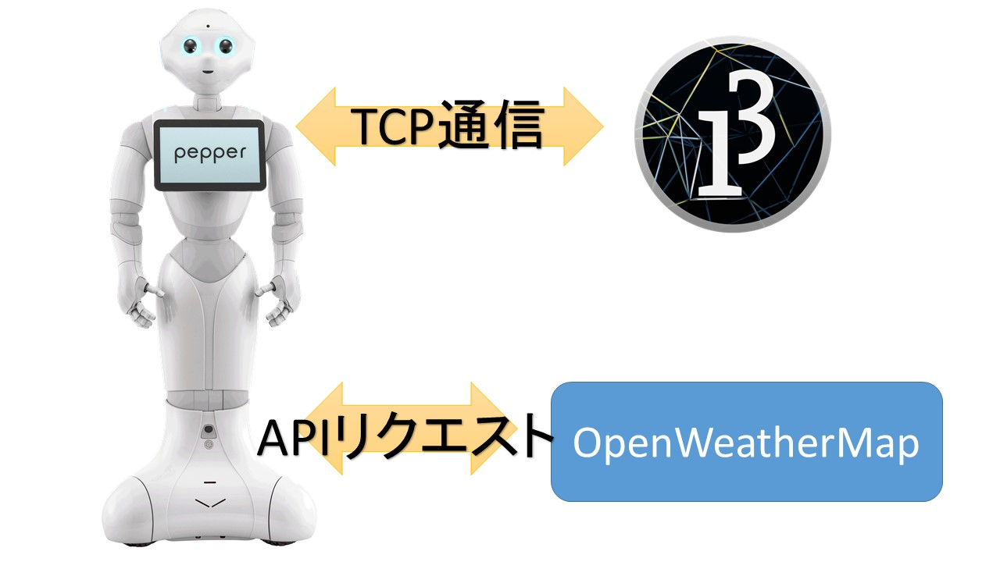
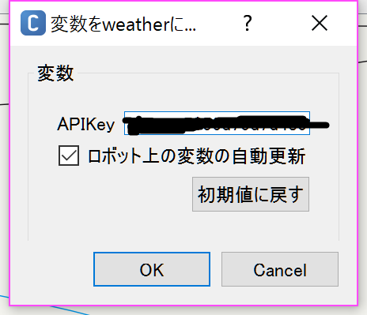
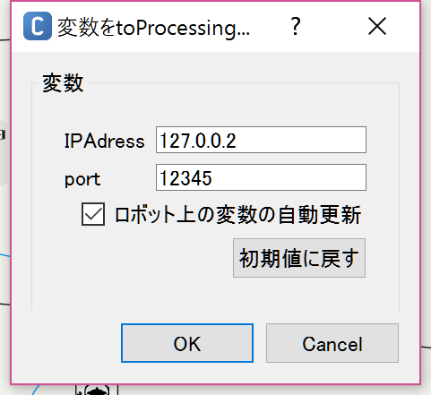

# Pepperに天気について聞くと、お天気マークが浮かび上がってくるやつ。

## Description
詳細

* 実装方法は以下


* タブレットがARマーカーになっている。

* processing側がサーバーで、ARを表示する。

* python側(pepper)がクライアント
  * 人の声を聞きとって、天気のことについて言ってたらマーカーを置き換える。
  * ネタでC3POの物まねをする。

## Demo

デモ


動画はこちら→[PepperAR](https://youtu.be/7kf0dqgL_VE)

## Requirement
実行環境

* processing3
* Python2.7(たぶん)
* choregraphe2.4.3
* pepper実機(´･ω･｀)

## Directory Structure
ファイル構成
```
.
├─ image //発表で使うあれこれ
├─main //choregrapheファイル
│  ├─behavior_1
│  ├─html //タブレットに載せる画像が入ってる。
│  ├─lib //pythonのライブラリあれこれ
│  ├─.metadata
│  ├─main.pml //主なファイル、ここがpepperのキモ
│  └ manifest.xml
├─python_server //processingファイル
│  ├─code //ARtoolkitが入ってる
│  ├─data //マーカ,3Dオブジェクト,天気マークが入ってる
│  └ python_server.pde
└README.md
```
## Usage
使い方

* main/main.pmlを開く

* weatherのpythonボックスの設定を開く(トンカチマークをクリックする。)

* OpenWeatherMapのAPIキーを入力



* toProcessingのpythonボックスの設定を開く(トンカチマークをクリックする。)

* IPアドレスを、ターミナルかコマンドでipconfigしてパソコンのIPアドレスを調べる

* IPアドレスをちゃんと書き換える



* python_server.pdeを開いて、ポートがpythonボックスを同じかどうか確認する
```processing
void setup(){
  server=new Server(this,12345);//第２引数はポート番号
}
```

* processingを起動したあとに、choregrapheを起動
## Install
  
### インストール方法
  
```
 > git clone 
```
か
zipでダウンロード
  
## Reference
参考したサイト
* [TCP/IPの基礎の基礎を理解してますか？](http://ascii.jp/elem/000/000/424/424788/)
* [ソケット](http://research.nii.ac.jp/~ichiro/syspro98/socket.html)
* [pepperとsoket通信](http://nextdeveloper.hatenablog.com/entry/2015/02/12/161544)
* python
  * [_future_モジュールについて](http://salinger.github.io/python/20140211-future-module/)
  * [python-if_name_=='_main_'の意味](http://azuuun-memorandum.hatenablog.com/entry/2015/05/09/002549)
  * [Unicode文字列(ユニコ―ド文字列)](http://www.pythonweb.jp/tutorial/string/index5.html)
  * [Pythonでネットワークプログラミング](http://memo.saitodev.com/home/python_network_programing/)
  * [Pythonによる通信処理](http://qiita.com/nadechin/items/28fc8970d93dbf16e81b)
* pepper
  * [Pepperアプリケーション開発　～外部ライブラリの読み込み～](http://arit-clt.com/2014/11/19/pepper-pepper%E3%82%A2%E3%83%97%E3%83%AA%E3%82%B1%E3%83%BC%E3%82%B7%E3%83%A7%E3%83%B3%E9%96%8B%E7%99%BA%E3%80%80%EF%BD%9E%E5%A4%96%E9%83%A8%E3%83%A9%E3%82%A4%E3%83%96%E3%83%A9%E3%83%AA%E3%81%AE/)
  * [Qiita](http://qiita.com)
* processing
  * [画像を透過にするには](http://mslabo.sakura.ne.jp/WordPress/make/processing%E3%80%80%E9%80%86%E5%BC%95%E3%81%8D%E3%83%AA%E3%83%95%E3%82%A1%E3%83%AC%E3%83%B3%E3%82%B9/%E7%94%BB%E5%83%8F%E3%82%92%E9%80%8F%E6%98%8E%E3%81%AB%E3%81%99%E3%82%8B%E3%81%AB%E3%81%AF/)

## Materials
* [イラスト屋](http://www.irasutoya.com/)
* [TF3DM](http://tf3dm.com/)(たぶん…)